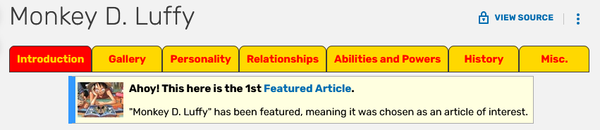
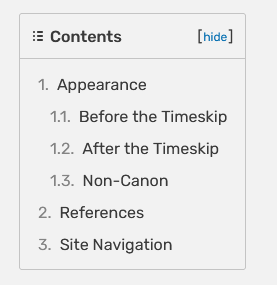
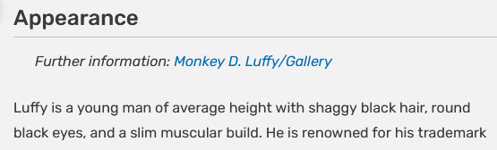
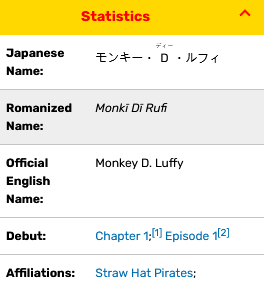

# Bootstrap Tools

Automated system for populating the character database from the One Piece wikia:

- Scrapes character data from the One Piece wikia
- Initializes SQL and vector databases
- Downloads and processes character avatars
- Generates AI-powered descriptions and fun facts
- Stores all data in SQL and vector databases

## System Overview

The bootstrap system consists of two separate phases that must be run independently and sequentially:

### Phase 1: Preparation and Discovery

This phase sets up the database infrastructure and creates a list of all characters. Then, it scrapes character wiki pages to discover what sections (page tabs, paragraph headings) and table rows exist across all characters, without extracting the actual paragraph text or table data for each character.

**What it does:**
- Scrapes the character list from One Piece wiki
- Creates `character_data.csv` with character IDs and wiki URLs
- Initializes SQL and vector databases (empty at this point)
- Discovers available section names and table row names across all character pages
- Generates `data/discovery_results.txt` containing all discovered names

> **Why discovery instead of direct extraction?**
>
> The wikia structure is very inconsistent, which makes it difficult to scrape effectively. Additionally, there's a lot of irrelevant information on wikia pages that isn't useful for the game and could create noise for RAG queries.
> The discovery step allows you to see all sections and table rows, and choose the ones that are actually needed for the knowledge base creation.

#### What Gets Discovered

The discovery process identifies two types of data across all character pages:

**Sections**

Sections are found throughout the character wiki page and consist of:

- **Page sections**: Tab headings at the top of the page (e.g., "Introduction", "Gallery", "History")

  


- **Paragraph headings**: Top-level items in the table of contents

  

Each section contains paragraph content beneath it. When a section is whitelisted, all its paragraphs are extracted and added to the vector database as documents for RAG queries.



**Tables**

The infobox is located directly under the character image and contains multiple tables such as "statistics", "portrayal", "devil fruit", etc. Each table has rows with specific data fields.

When a table row is whitelisted, the data is extracted and stored as structured data in the SQL database. Each entry requires specifying both the row name and table name to extract from.




#### Action Required After Phase 1

Review `data/discovery_results.txt` and manually configure `bootstrap_settings.py` with your choices (case-insensitive):

**WHITELISTED_SECTIONS** - Section names whose paragraph content you want to extract

Example configuration:
```python
WHITELISTED_SECTIONS = [
    'Abilities',
    'Appearance',
    'History',
    'Personality',
    # Add sections based on discovery_results.txt
]
```

**WHITELISTED_STATISTICS** - Specific table rows to extract from infobox tables


Example configuration:
```python
WHITELISTED_STATISTICS = [
    ('age', 'statistics'),
    ('height', 'statistics'),
    ('bounty', 'statistics'),
    # Add statistics based on discovery_results.txt
]
```

### Phase 2: Data Extraction

This phase extracts the actual content based on your configuration.

**What it does:**
- For each whitelisted section: Extracts paragraph content and stores it as documents in the vector database
- For each whitelisted statistic: Extracts structured table data and stores it in the SQL database
- Downloads and processes character avatar images (large and small versions)
- Generates AI-powered descriptions and fun facts for each character
- Extracts and stores character affiliations

All character processing happens in a single pass with built-in rate limiting and error recovery.

## Directory Structure

```
bootstrap_tools/
├── phase1_preparation/           # Initial setup scripts
│   ├── build_character_csv.py    # Creates character list from wiki
│   ├── database_builder.py       # Initializes databases
│   └── section_and_table_discovery.py  # Discovers available wiki data
├── phase2_processing/            # Main character processing
│   ├── character_processor.py    # Main processing pipeline
│   ├── enhanced_character_scraping.py  # Wiki data extraction
│   ├── data_storage_manager.py   # Unified data storage
│   └── generate_small_avatars.py # Avatar thumbnail creation
├── data/                         # Generated data files
│   ├── character_data.csv        # Character list with wiki URLs
│   └── discovery_results.txt     # Section discovery output
├── bootstrap_settings.py         # Configuration settings
├── bootstrap_orchestrator.py     # Main entry point
└── README.md                     # This file
```

## Processing Settings

Note: The wikia allows frequent requests, but image downloads have stricter rate limits.

Modify `bootstrap_settings.py` to adjust rate limiting:
- `DELAY_BETWEEN_CHARACTERS`: Base delay between character processing (default: 1.0 seconds, with random ±0.5s variation for 0.5-1.5s range)
- `DELAY_BETWEEN_REQUESTS`: Delay between individual web requests (default: 0.1 seconds)

## Usage Examples

### Production Workflow
```bash
# 1. Initial setup (first time only)
python bootstrap_orchestrator.py --phase=1

# 2. Configure bootstrap_settings.py based on discovery results

# 3. Process all characters
python bootstrap_orchestrator.py --phase=2
```

### Development and Testing
```bash
# Check current system status
python bootstrap_orchestrator.py --status

# Test with limited characters
python bootstrap_orchestrator.py --phase=2 --limit=5

# Resume interrupted processing
python bootstrap_orchestrator.py --phase=2 --start-from="CHARACTER_ID"

# Skip CSV generation if it already exists
python bootstrap_orchestrator.py --phase=1 --skip-csv
```

## Error Handling and Recovery

### Built-in Error Recovery
- **403 Rate Limiting**: Automatic 5-minute breaks after consecutive 403 errors
- **Network Timeouts**: Individual character failures don't stop processing
- **Processing Interruption**: Resume from last processed character
- **Retry Logic**: Up to 3 attempts per character for transient failures

### Common Recovery Commands
```bash
# Resume from specific character
python bootstrap_orchestrator.py --phase=2 --start-from="FAILED_CHARACTER_ID"

# Check what has been processed
python bootstrap_orchestrator.py --status

# Reprocess specific range
python bootstrap_orchestrator.py --phase=2 --limit=50 --start-from="CHARACTER_ID"
```

## Output and Results

### Generated Assets
- **SQL Database**: Complete character information with structured data
- **Vector Database**: Semantic embeddings for character search
- **Large Avatars**: High-resolution character images (client/public/img/avatars/large/)
- **Small Avatars**: Thumbnail versions for UI (client/public/img/avatars/small/)
- **AI Content**: Generated character descriptions and fun facts

## Performance

### Expected Processing Times
For ~2500 characters:
- Phase 1 (with discovery): 1-1.5 hours
- Phase 2 (full processing): 3 hours
- Total system setup: 4-5 hours

## Monitoring and Status

The system provides detailed progress tracking:
- Real-time processing status with character counts
- Success/failure rates for each component
- Detailed statistics on data extraction and storage
- Resume capabilities with specific character targeting

Use `--status` to check current system state including:
- Character CSV existence
- Database connection and content
- Avatar file counts
- Discovery results availability

## Dependencies

Key Python packages:
- requests (wiki scraping)
- BeautifulSoup4 (HTML parsing)  
- Pillow (image processing)
- pandas (data manipulation)
- SQLAlchemy (database ORM)
- ChromaDB (vector database)

The system integrates with the main application's:
- Database models and configuration
- Vector database setup
- LLM services for content generation
- Prompt services for AI interactions